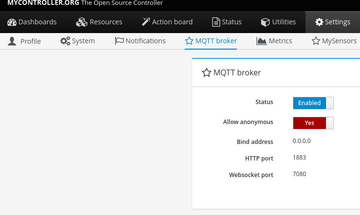
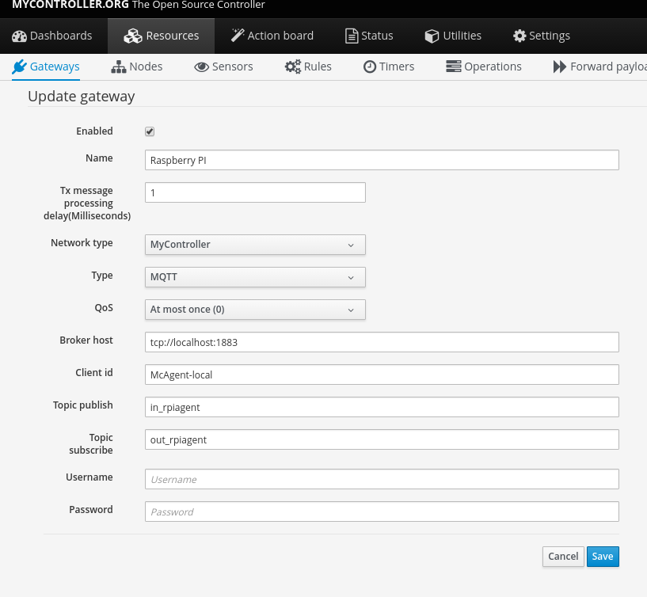
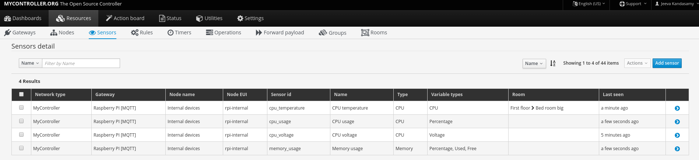

### MyController Raspberry PI agent
McAgent to controller Raspberry PI GPIO pins. This agent is using http://pi4j.com/[PI4J] to control GPIO's.

[link=https://travis-ci.org/mycontroller-org/mcagent-rpi]
Master: image:https://travis-ci.org/mycontroller-org/mcagent-rpi.svg?branch=master["Build Status", link="https://travis-ci.org/mycontroller-org/mcagent-rpi"]

### How to setup this agent on Raspberry PI (RPI)?
##### Steps on MyController
* You need to enable MQTT broker service on MyController server.



* Create a MQTT gateway as shown here,



##### Steps on MCagent
* Do login in to your RPI as a root user
* Download recent version from https://drive.google.com/drive/u/0/folders/0BzuumrtRA7p6OGM1UEdGY2RwUDA[here]
* Extract downloaded file `tar xzf mcagent-rpi-0.0.1-SNAPSHOT-bundle.tar.gz`
* `cd mcagent`
* Start the agent `bin/start.sh`
* You can see the log file on `logs/mcagent.log`

Now you can see the list of internal sensors on MyController server.



#### MCagent properties:

* File location: `conf/mcagent.properties`
* Default `pin.numbering.scheme`: `DEFAULT_PIN_NUMBERING`. Supported options: `DEFAULT_PIN_NUMBERING`, `BROADCOM_PIN_NUMBERING `
* To know more about `pin.numbering.scheme` http://pi4j.com/pin-numbering-scheme.html[click here]
* when you are running this agent on remote RPI, configure MQTT settings on this file,
```
#========================================================================
# MQTT client settings
# Add MQTT client configurations here.
# All communications must happens via on MQTT only!
#========================================================================
mcac.mqtt.broker.host=tcp://localhost:1883
mcac.mqtt.clientid=mc-rpi-client
mcac.mqtt.username=
mcac.mqtt.password=
mcac.mqtt.feed=rpiagent
```

**Important:** When you change anything on mcagent file. MCagent restart is required to update your changes.

#### How to control GPIO pins
You can control any GPIO from MyController. However, you have to do one-time setup on `MCagent` as follows.

##### Steps:
* Add GPIO entry on the file `conf/devices.yaml` **Note:** you should follow YAML syntax.
* GPIO pins should be added under `gpio_devices:`

Few examples,

#### Input (switch, push button, etc)
```yaml
- id: sample_digital_in_gpio_0
  name: Sample digital input switch
  type: DIGITAL_IN
  enabled: true
  properties:
    pin: gpio 0
    pull_resistance: pull_up
    debounce_interval: 100
```
* `id` - is the id used as MyController sensor id
* `name` - is the name used as MyController sensor name
* `type` - What the type of this sensor. Supported types: `DIGITAL_OUT`, `DIGITAL_IN`, `SOFT_PWM_OUT`, `PWM_OUT`, `TEMPERATURE_DS18B20`
* `enabled`: We can enable or disable this sensor
* `properties`: This properties based on `type of sensor`. here it supports for the following properties,
   * `pin`: pin number on RPI
   * `pull_resistance`: supported types: `pull_up`, `pull_down` and `off`
   * `debounce_interval`: debounce_interval in milliseconds


#### Output (on/off switch)
```yaml
- id: sample_digital_out_gpio_2
  name: Sample on/off relay control
  type: DIGITAL_OUT
  enabled: true
  properties:
    pin: gpio 2
```

#### PWM output
```yaml
- id: sample_pwm_out_gpio_23
  name: Sample PWM out
  type: PWM_OUT
  enabled: true
  properties:
    # All Raspberry Pi models support a hardware PWM pin on GPIO_01.
    # models A+, B+, 2B, 3B also support hardware PWM pins: GPIO_23, GPIO_24, GPIO_26
    pin: gpio 1
    range: 1024
    # supported modes: balanced, mark:space
    # for detail refer http://wiringpi.com/reference/raspberry-pi-specifics/
    mode: balanced
    clock: 500
```

#### Soft PWM
```yaml
- id: sample_soft_pwm_out_gpio_3
  name: Sample Soft PWM out
  type: SOFT_PWM_OUT
  enabled: false
  properties:
    pin: gpio 3
    range: 100
```

#### Temperature sensor (ds18b20)
```yaml
- id: temperature_ds18b20
  name: Temperature sensor
  type: TEMPERATURE_DS18B20
  enabled: true
  properties:
    device_address: 28-011615318bee
    # scale can be either CELSIUS, FARENHEIT, KELVIN or RANKINE
    scale: CELSIUS
    cron: 0,30 * * * * ?
```
* `device_address`: Manually you have to find device address and update
* `scale`: scale can be either `CELSIUS`, `FARENHEIT`, `KELVIN` or `RANKINE`
* `cron`: When using the temperature sensor. you have to mention how long once you want to report the temperature value to MyController via Cron expression. `0,30 * * * * ?` - reports on 0th second and 30th second.

#### How to control internal
These are all the default sensors to monitor RPI internals, However, can change reporting frequency and/or enable/disable
```yaml
internal_devices:
- id: cpu_temperature
  enabled: true
  properties:
    cron: 0 0/2 * * * ?

- id: cpu_voltage
  enabled: true
  properties:
    cron: 0 0/10 * * * ?

- id: memory_usage
  enabled: true
  properties:
    cron: 0 0/5 * * * ?
    unit: MB

- id: cpu_usage
  enabled: true
  properties:
    cron: 0/30 * * * * ?
```
